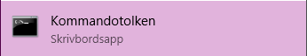
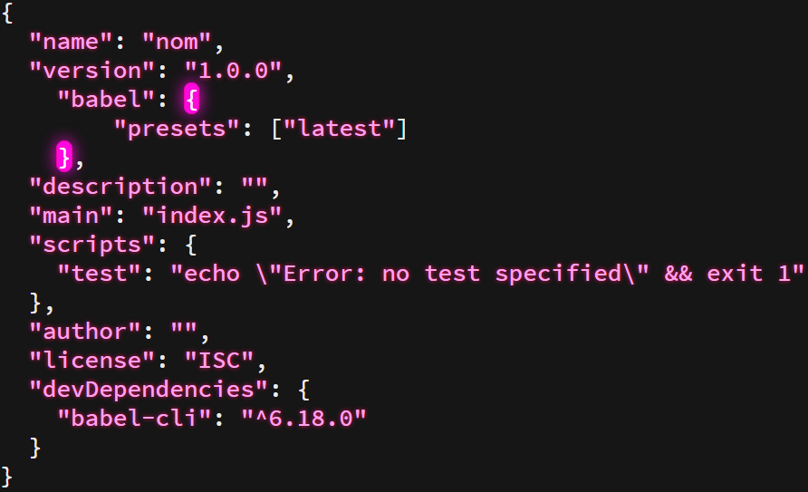

[NODEJS]: https://nodejs.org/en/docs/ "Learn more about NodeJS"
[NPM]: https://docs.npmjs.com/getting-started/what-is-npm "Learn more about NPM"
[BABEL]: https://babeljs.io/ "Babel documentation"
[DOWNLOAD]: https://nodejs.org/en/ "Find"

##Complete guide to installing Babel

In this tutorial, we are going to learn how to install Babel on your machine and get you some basic knowledge about NodeJS and NPM.
  

#####What is NodeJS?
NodeJS is a JavaScript runtime that is based of Chrome's V8 JavaScript Engine. Node helps us create a runtime environment for JavaScript and are required to be installed by certain other environment tweaking applications such as Babel in this case.
 

You can read more about NodeJS here: [NodeJS Documentation] [NODEJS]
 
#####What is NPM?
NPM stands for NodeJS Package Manager and it handles all packages you want to install and run on your unit. You can read more about Node Package Manager by following this link: [NPM Documentation] [NPM]

#####What is Babel?
Babel used to only focus on translating our ES scripts into JavaScript, but the main focus has changed and instead we are greeted with plugins that does the same thing for Babel. Now Babel is known as a JavaScript Compiler that supports plugins for your scripting needs.
   

####Babel requirements for a successful installation:
To run Babel on your machine you must install both NodeJS and NPM. Make sure that the versions you chose works with babel. I highly suggest attempting updating your NodeJS & NPM versions before continuing installing Babel as issues might occur otherwise.

  

####Three simple methods of locating a folder in command prompt. (Windows)

  

#####Method 1:
Simply open the windows explorer, locate the folder, and then click on the explorer’s search bar, type CMD and hit enter. This should automatically locate the current folder.
#####Method 2:
Another easy method is to open the windows explorer, locate the folder and then right click inside the folder where the CMD should be located to while holding the shift key. This should give you a "secret" option to open a command prompt in that direction.
#####Method 3:
Open up the windows command prompt and enter the following command: <code>cd enter you’re directory here.</code> 

So essentially if i were to head to my C drive i would type the following: <code>cd C:/</code>

  

####Installing Babel

#####Step One:
To install Babel, as stated above, we require a nodeJS installation. Also, stated above I personally suggest updating nodeJS before we continue the installation. If you don't have nodeJS installed, you can find it [here][DOWNLOAD].

If you have NodeJS installed, and I am assuming you do at this point, you should attempt updating it to a later version if possible. To find which version of Node you are running you should open a command prompt and type the following command: <code>node -v</code>

NPM should be installed with your installation of NodeJS, you can check your NPM version that your machine is running by typing the following command in a command prompt: <code>npm -v</code>
 
#####Step Two:
Once node is successfully installed we want to continue to create a folder or locate a folder which should use babel for our written ES code. Once a folder is created or located, open a command prompt, and locate it to the folder. 

Now we want to enter the command: <code>npm init</code>
This is used to create a basic <code>package.json</code> file.

<i>(See the section above to see how to easily locate a folder by using command promt.)</i>
 

#####Step Three:
The next step would to install babel cli and update config file with Babel’s latest preset.

To do this, we type the following command line: <code>npm install --save-dev babel-cli babel-preset-latest</code>

If you already have Babel CLI installed, you should leave that section out of the command like this: <code>npm install babel-preset-latest</code>

#####Step Four:
Now once Babel is essentially successfully installed there is a few things left to do, to use Babel for your scripting needs.

You should now create two folders inside the directory, one should be called: <code>src</code> and the other one should be named: <code>lib</code>.

#####Step Five:
Next up, we should edit the config <code>package.json</code> for our Babel needs. We require to add the following to our config file: 
  <code>
{
 
       "presets": ["latest"]
  
}</code>

Remember to use a <code>,</code> if you are inserting this part inside the script where it should be required.

Your config file should look something like the following depending on where you have decided to insert the new line of code.
  

#####Step Six:
The last part is to setup the build environment to increase your efficiency in your work flow and to understand how to run Babel. You created the folders in the last step. The folder <code>src</code> is where you should insert your code that should be translated into working JavaScript code, once translated you will find a translated copy of the scripts inside your newly created <code>lib</code> folder. But first Babel must be booted up once to get a translated script.

We are now going to edit the config file again and add or change the build line to: <code>"build": "babel --watch src -d lib"</code>.

We are using <code>--watch</code> to always rebuild our scripts and make it an automatic process to translate code. 

<i>(Stops forcing us to re run commands, instead it does it for us!)</i>
  

   
###Thanks!
Thanks for following this quick tutorial and if you have any issues with Babel you can follow this link to learn more about Babel: [Babel's website] [BABEL]
   
<i>Written by IGL43X for Realgymnasiet T4.</i>
