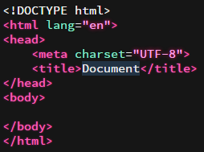
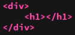
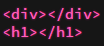
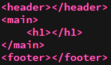
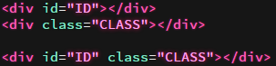
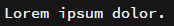
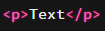
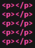
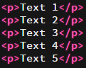

#Nybörjar guide för Emmet

 

####Vad är Emmet och varför ska jag installera Emmet?
Emmet är ett relativt stort tillägg till webbutvecklings redigerare. Emmet är designat för att kunna programmera dina webbplatser snabbt, smidigt och så enkelt som möjligt.

 
####Enkel förklaring utav användning
Emmet använder sig av en funktion/ett kommando för att veta vad som ska göras. Efter ett kommando har skrivits använder vi tab för att aktivera kommandet. Kommandet skrivs på samma rad som det ska exekveras inom.

 

####Installation och inställningar
Det är enkelt att installera Emmet, detta kan ske igenom Github eller Brackets tillägghanterare. För att navigera till tillläggshanterare bör du klicka på arkiv, sedan på tilläggshanteraren.

    

####Användningsområden

Vi tar ett väldigt enkelt exempel, detta kommando sätter upp en bra html5 mall för en snabb och enkel start. Allt du behöver göra är att skapa ett html dokument och skriva html:5, sedan klickar du bara tab knappen!

 
####Användning:
    html:5
####Resultat:
</img>

    

#####För att skapa en tagg som befinner sig inom en annan tagg så kan du skriva:
######Exempel: 
    div>h1
####Resultat:
</img>
    

#####Om du skulle vilja skapa två taggar utav olika sorter så kan du skriva:
######Exempel: 
    div+h1
####Resultat:
</img>
    

#####För att enkelt kunna specificera exakt vart vi vill lägga in taggar kan vi skriva så här..
######Exempel: 
    header+(main>h1)+footer
####Resultat:
</img>
    

#####För CSS användning finner vi det enkelt att sätta olika ID och klasser på våra taggar.
######Exempel: 
    div#ID
    div.CLASS
    div#ID.CLASS
####Resultat:
</img>
    

#####Om du behöver fylla i ett antal ord med genererad text kan detta kommando hjälpa dig enkelt. Du kan fylla i vilken siffra du vill efter du skrivit lorum.
######Exempel: 
    lorum3
####Resultat:
</img>
    

#####För att skriva inom en tagg så kan vi skriva så här..
######Exempel: 
    p{Text}
####Resultat:
</img>
    

#####Om vi vill använda oss utav flera av samma tagg så kan vi skriva så här..
######Exempel: 
    p*5
####Resultat:
</img>
    

#####Nu om vi skulle vilja skriva med unika siffror inom varje tagg skriver vi ett dollar tecken.
######Exempel: 
    p{Text $}*5
####Resultat:
</img>
    