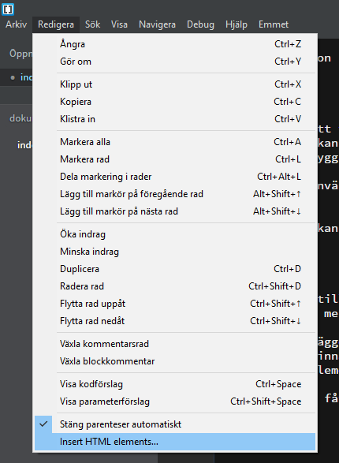

###HTML Skeleton

 

####Syfte
Skeleton är ett tillägg som finns till för att hjälpa webbutvecklare att snabba på processen utav att skapa en webbplats som skrivs i HTML5.
Detta tillägg kan hjälpa dig att både snabba upp processen samt för att få nyare webbutvecklare att enklare förstå HTML då de kan se ett resultat enkelt visuellt igenom att enkelt kunna bygga upp olika test miljöer.

Detta tillägg används för att enkelt använda ett gränssnitt för att bygga upp simpla kodsnuttar inom ditt dokument för att spara tid och för att minimera handskriven kod.

Detta tillägg kan vara användbart för både en nybörjare samt en erfaren webbutvecklare.

 

####Användning
För att börja tillägget måste du hämta tillägget ifrån HTML Skeletons Github sida eller via Brackets tilläggshanterare som är inbyggt inom webbutvecklingsverktyget. Du kan hitta det under dropdown meny sektionen "Arkiv".

Sedan när tillägget är installerat i Brackets så kan du börja använda det så fort du har skapat ett HTML dokument. Klicka på att redigera dokumentet och sedan klicka på din nya ikon som ska finnas på tilläggshanteraren till höger inom Brackets fönstret.  

 

Om du inte finner ikonen så finns samma val under dropdown menyvalet Redigera, sedan klickar du på "Insert HTML Elements...".

När du väl har fått upp verktyget så kan du börja implementera exakt vad du vill använda inom ditt valda dokument.